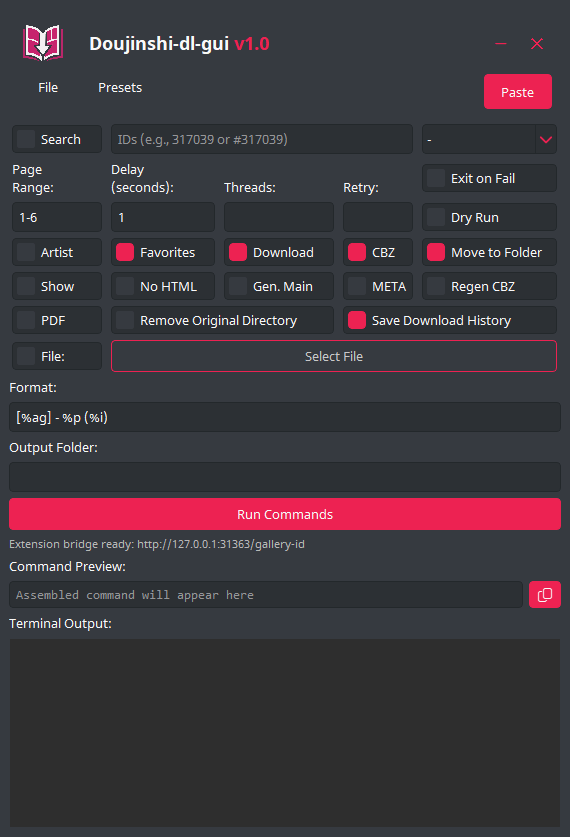

# doujinshi-dl-gui

**Please note that doujinshi-dl-gui is designed to work alongside RicterZ's [doujinshi-dl](https://github.com/RicterZ/doujinshi-dl) repository.**

doujinshi-dl-gui is a graphical user interface for interacting with RicterZ's doujinshi-dl command-line tool. It provides a more user-friendly way to configure and run doujinshi-dl commands without needing to use the command line directly.

## Features

- Configure various download options using checkboxes, input fields, and dropdown menus.
- Presets for easy command configuration.
- Allows for searching and sorting results.
- Select files to download using .txt files.
- Interactive interface for setting your API token.
- Language selection for content filters.
- Paste Button: A dedicated Paste button is always visible in the title bar. Left-clicking it pastes clipboard content into the ID input, while right-clicking clears the input first—ideal for quick batch entry.
- Remember Window Position: Toggle this option under File → Options to have the GUI remember its last screen position across launches.

## Requirements

- Python 3.7+
- PyQt6 library
- RicterZ's doujinshi-dl
## Optional
- Load the [doujinshi-dl-gui-browser-extension](https://github.com/edgar1016/doujinshi-dl-gui-browser-extension) Chrome/Brave extension to send gallery IDs straight to the app.

## Getting Started

**Running with Python**
1. Download and install RicterZ's doujinshi-dl from [here](https://github.com/RicterZ/doujinshi-dl).
2. Download this repos source code and unzip it.
3. Install the required Python packages using pip and the `requirements.txt` file inside the doujinshi-dl-gui folder.
   - `pip install -r /path/to/requirements.txt`
5. Run the `doujinshi-dl-gui.py` file inside doujinshi-dl-gui to start the GUI.

**Running the Windows Executable**
1. Download the latest release.
2. Extract the zip.
3. Open doujinshi-dl-gui.exe.

**Set a Default Directory for Downloads** 
- You can set a default folder for all your downloads to go to by going to `File -> Options -> Set Default Directory` 
or you can just paste the path in the Output Folder input box as needed.
- When you have a default folder set, any content entered into the Output Folder box will be appended to the end of your default folder path. This is particularly handy for organizing multiple doujins from the same series into specific subfolders within your default folder.

**Set, Delete, Rearrange & Update Presets** 
- Right click on the presets button or go to File -> Options -> `Manage Presets ` to open the Presets windows.
- Presets are stored within `settings.ini` the file is located in `%APPDATA%\doujinshi-dl-gui\settings.ini`.

## Setting Your API Token

doujinshi-dl-gui authenticates using an API token instead of cookies.

1. Log into your account on a supported site.
2. Go to Account Settings search for API Keys and generate/copy your API key.
3. In doujinshi-dl-gui, click File -> Options -> Set API Token.
4. Paste the copied key into the "API Token" field and click "Submit."
5. The token will be set and the window will close itself.

## Optional: Brave/Chrome Helper Extension

Load the helper from the [doujinshi-dl-gui-browser-extension](https://github.com/edgar1016/doujinshi-dl-gui-browser-extension) repository to unlock this convenience:

- **Gallery ID bridge:** on a supported gallery page, left-click the gallery ID heading to append it to `ids_input`, or hold `Ctrl`/`Cmd` and left-click to clear first (when enabled). The extension shows desktop notifications whenever IDs are pushed successfully.
- **Not using the bridge?** Disable it in the GUI via `File -> Options -> Enable Extension Bridge` to stop the local server entirely.

Keep the GUI running so the built-in local bridge (`http://127.0.0.1:31363/gallery-id`) can receive the IDs from the extension.

## Screenshots

## Acknowledgements

- RicterZ's doujinshi-dl: [https://github.com/RicterZ/doujinshi-dl](https://github.com/RicterZ/doujinshi-dl)

## License

This project is licensed under the [MIT License](LICENSE).
